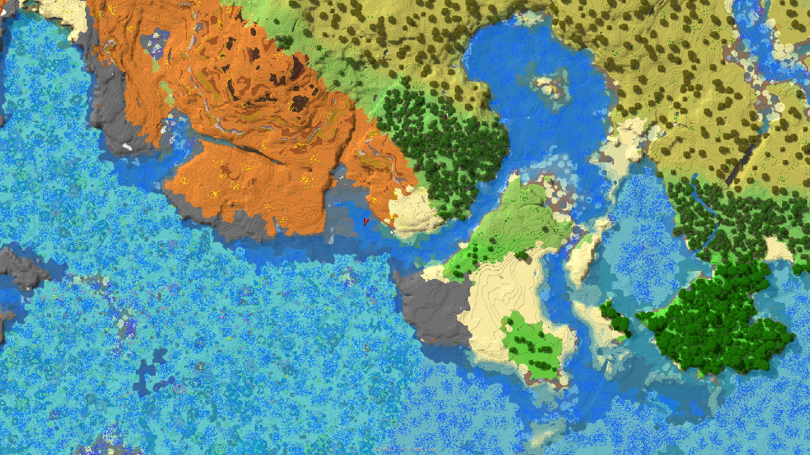
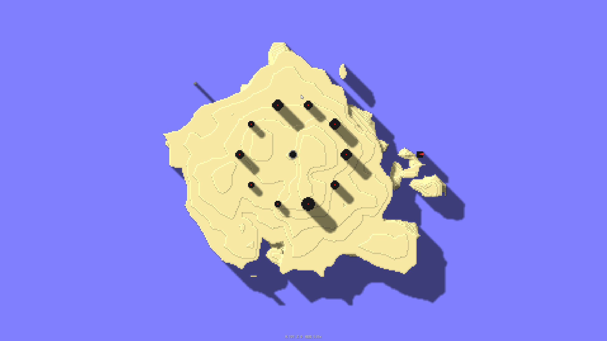
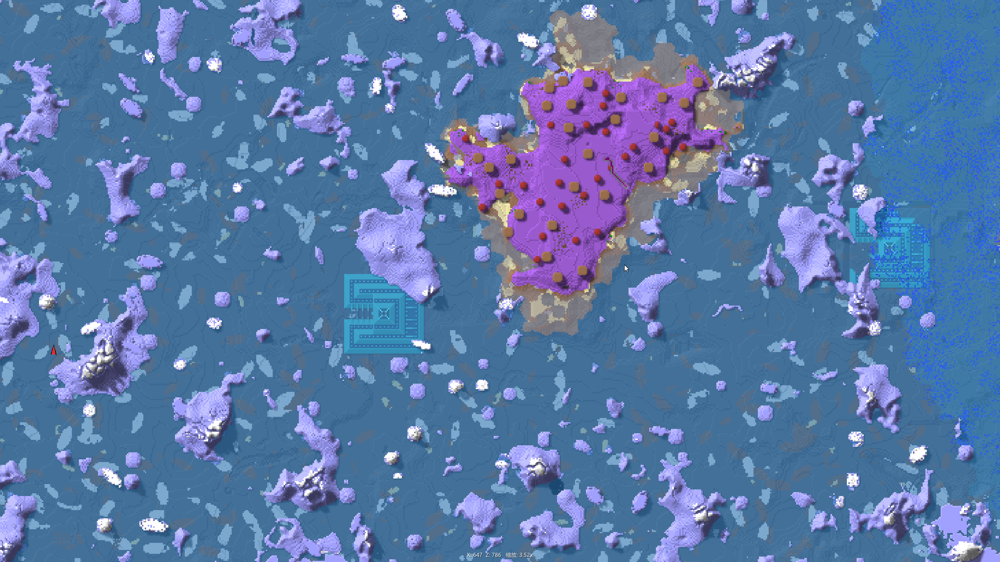

# CoralMap

English | [简体中文](README_zh.md)

基于 [LeviLamina](https://github.com/LiteLDev/LeviLamina) 的 Minecraft 基岩版（Windows 客户端）小地图 / 大地图 mod。通过 DirectX 11 钩子接入游戏渲染，使用 ImGui 绘制地图界面，仅客户端生效。

## 效果展示







## 功能特性

- **小地图**：屏幕右上角圆形小地图，显示周围地形、区块网格线、当前区块高亮、玩家朝向箭头与坐标，尺寸 / 边距 / 配色均可配置
- **大地图**：按 `M` 键开合（可在配置中改键），滚轮缩放（0.2 ~ 40 像素/方块）、鼠标拖拽平移；以 region（256×256 方块）为单位分块纹理拼贴渲染，并带 VRAM 闲置回收
- **地形着色**：按群系着色，颜色表来自 `resource/biome_color.json`，加载失败时自动回退到游戏内群系采样；支持透明水体效果（随水深增加不透明度）
- **阴影渲染**：三种模式——无阴影 / 简单高度图梯度阴影 / 阴影图 + 边缘 bevel，支持 PCF 柔化与固定光源方向（默认西北方向、天顶角 60°）
- **平滑相机**：弹簧-阻尼平滑跟随，力度与阻尼可调
- **后台地形扫描**：分帧扫描避免卡顿（默认每帧最多 32 chunk、半径 128 方块），按帧间隔自动重扫，脏块过多时切换为 region 级烘焙，支持 LevelDB 磁盘缓存

## 配置

首次加载后会在 mod 配置目录生成 `config.json`，常用项：

| 配置 | 说明 |
| --- | --- |
| `worldMap.toggleKey` | 大地图开合按键（Win32 虚拟键码，默认 `0x4D` 即 `M`） |
| `miniMap.sizeRatio` / `radiusChunks` | 小地图直径占窗口宽度比例 / 显示区块半径 |
| `terrain.scanRadius` / `scanMaxChunksPerFrame` | 扫描半径（方块）/ 每帧扫描 chunk 上限 |
| `terrain.enableDiskCache` | 是否启用磁盘缓存 |
| `terrain.shadow.*` | 阴影模式、强度、柔化半径、光源方向 |
| `fontSize` | 界面字号 |

## 构建

依赖：xmake、Visual Studio（clang-cl 工具链）、LeviLamina 客户端版及其 xmake-repo。

```bash
xmake f -y -p windows -a x64 -m release
xmake
```

构建成功后，mod 会打包到 `bin/CoralMap/`（含 `CoralMap.dll`、`manifest.json` 与 `resource/` 资源）。

## 安装

将 `bin/CoralMap` 整个文件夹复制到 LeviLamina 客户端的 `mods/` 目录，启动游戏即可。

## 项目结构

```
src/
├── mod/     入口（CoralMap 类、mod 注册、内存操作符）
├── render/  小地图 / 大地图渲染器
├── state/   地形扫描、区块管理、着色、阴影渲染等核心状态
├── data/    区块 / region 数据结构与内存、磁盘缓存
├── helper/  DX11 钩子、游戏事件钩子、输入拦截
└── config/  配置定义
```

## Contributing

欢迎通过 issue 提问、通过 PR 贡献代码。

## License

CC0-1.0 © CoralMap contributors
